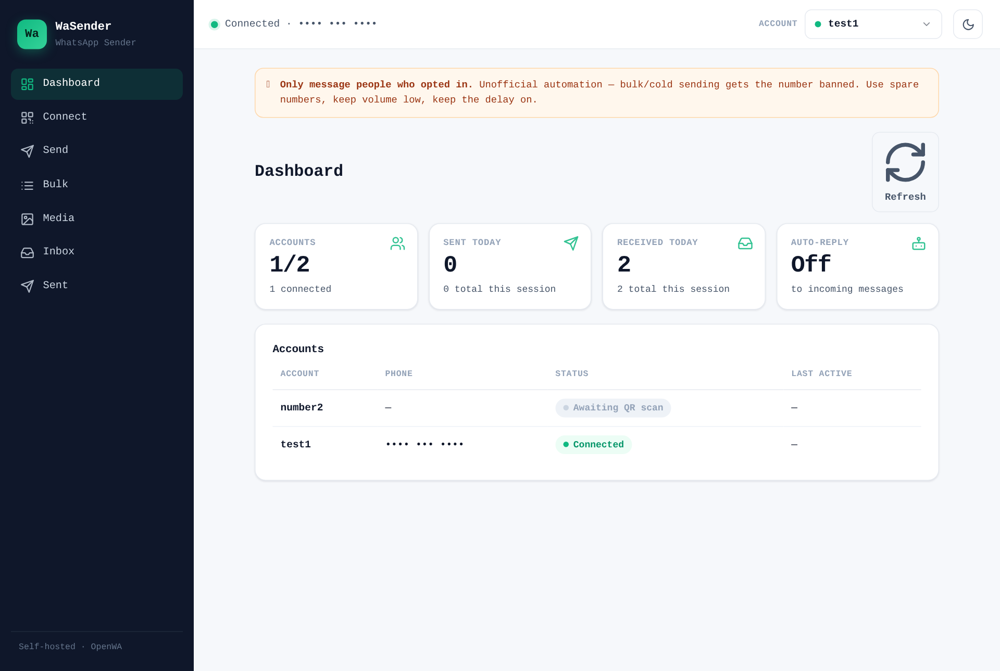

# WaSender


A clean, self-hosted **React** dashboard for sending WhatsApp messages through the
[OpenWA](https://github.com/rmyndharis/OpenWA) API. Link one or more WhatsApp
numbers via QR code, then send text, media, and bulk/personalised messages —
and receive replies — from a simple, responsive web UI.

```
Browser ──▶ WaSender (Node/Express, holds the API key) ──▶ OpenWA ──▶ WhatsApp
```

Your API key lives only in the server, never in the browser.

## Screenshot



## Features

- 📊 **Dashboard** — live stats (accounts, sent/received today) + account overview
- 📱 **Multi-account** — link several WhatsApp numbers, switch between them
- ✉️ **Send** single text messages
- 📋 **Bulk** send with **CSV import**, `{name}` personalisation, per-message delay + progress
- 🖼️ **Media** — send images, PDFs and documents from your computer
- 📥 **Inbox** — receive incoming messages via webhooks, with optional **auto-reply**
- 📤 **Sent history** — see what was sent, to whom, and when
- 💬 **Message templates** — save and reuse common messages
- 🌙 **Dark / light theme** and 📱 **fully responsive** (phone, tablet, desktop)
- 🔌 **Unlink** (logout) a number from the dashboard

## Tech stack

| Layer | Tech |
| --- | --- |
| Frontend | React 18 + Vite |
| Backend | Node.js + Express |
| WhatsApp engine | [OpenWA](https://github.com/rmyndharis/OpenWA) (whatsapp-web.js) in Docker |

## ⚠️ Important

OpenWA automates WhatsApp through an **unofficial** browser engine. Bulk or cold
messaging gets numbers **banned**. Only message people who opted in, use a spare
number, and keep volume low with sensible delays.

## Prerequisites

- [Node.js](https://nodejs.org) version 18 or newer
- A running [OpenWA](https://github.com/rmyndharis/OpenWA) instance (Docker) and its API key

## Setup

```bash
# 1. Configure
cp .env.example .env        # then edit .env with your OpenWA URL + API key

# 2. Install
npm install

# 3. Build the React UI, then start the server
npm run build
npm start                   # serves at http://localhost:3000

# shortcut (build + start):  npm run serve
# live-reload dev mode:      npm run dev   (Vite on :5173, proxies API to :3000)
```

Open <http://localhost:3000>.

### Environment (`.env`)

| Variable         | Description                             | Default                                     |
| ---------------- | --------------------------------------- | ------------------------------------------- |
| `OPENWA_URL`     | Base URL of your OpenWA instance        | `http://localhost:2785`                     |
| `OPENWA_API_KEY` | OpenWA API key                          | —                                           |
| `SESSION_ID`     | Default account/session name            | `test1`                                     |
| `PORT`           | Port WaSender listens on                | `3000`                                      |
| `WEBHOOK_URL`    | URL OpenWA calls for incoming messages  | `http://host.docker.internal:3000/webhook`  |

## Usage

1. **Connect** → pick/add an account → *Connect / Show QR* → scan with WhatsApp ›
   Linked devices.
2. **Send / Bulk / Media** → compose and send from the linked account.
3. **Inbox** → *Enable receiving* to register the webhook; toggle auto-reply.

## Security

- Bind OpenWA to localhost or put it behind a reverse proxy with auth.
- Never commit your `.env` (this repo ignores it by default).
- Don't expose the WaSender port publicly without adding authentication.

## License

[MIT](LICENSE)
